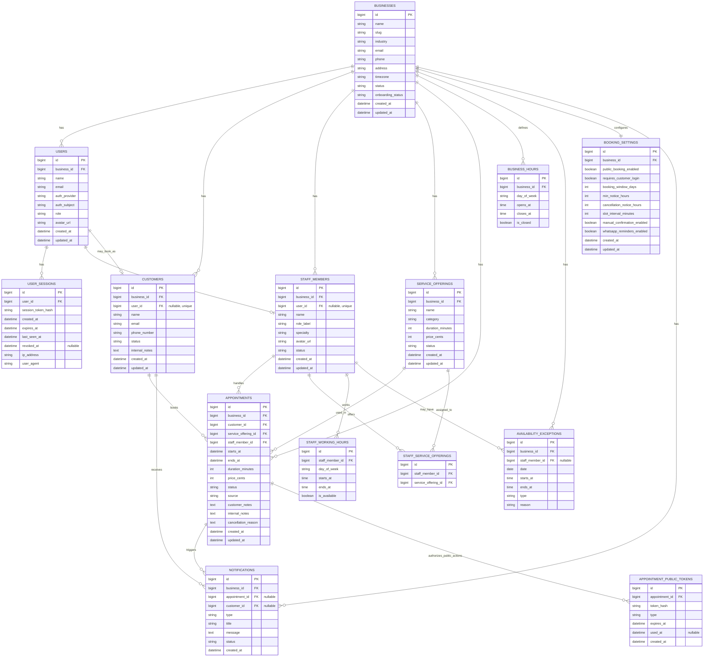

# Turnero API - Esquema DB MVP

## Proposito

Este documento describe el esquema de base de datos propuesto para el MVP de Turnero, tomando como referencia las pantallas aprobadas en Stitch y el caso inicial de negocio:

- Tiendas chicas primero.
- Un negocio por cuenta.
- Un admin/dueno que tambien puede atender turnos.
- Booking cliente sin login obligatorio.
- Agenda diaria como centro operativo.

La idea principal es separar dos conceptos:

- `users`: personas que pueden entrar al sistema y tienen permisos.
- `staff_members`: personas que atienden turnos y aparecen en agenda/booking.

Una misma persona puede ser ambas cosas. Por ejemplo, el dueno puede ser `USER` con role `OWNER` y tambien `STAFF_MEMBER` con `role_label` `Barbero`.

## Diagrama ER



## Valores controlados

Para el MVP, estos campos deberian implementarse como enums en backend y como `CHECK constraint` en DB cuando se definan migraciones.

### Roles de users

```text
OWNER
ADMIN
RECEPTIONIST
STAFF
CUSTOMER
```

Para el MVP inicial alcanza con `OWNER`. El resto queda preparado para evolucionar permisos y portal cliente.

### Auth provider de users

```text
GOOGLE
```

Post-MVP posible:

```text
AUTH0
OKTA
```

`auth_provider` identifica quien autentico la identidad externa. `auth_subject` guarda el identificador estable que entrega ese proveedor para el usuario.

En MVP se implementa Google directo para aprender y avanzar rapido, pero los nombres quedan genericos para permitir migrar post-MVP a Auth0 u otra plataforma sin cambiar el modelo interno de Turnero.

Reglas de autenticacion MVP:

- El backend solo puede crear o autenticar `users` desde Google si el claim `email_verified` viene en `true`.
- Turnero no envia emails de verificacion en MVP; delega esa verificacion en Google.
- `auth_subject` sigue siendo el identificador externo principal; `email` se guarda como dato de contacto y apoyo operativo.

### Status de businesses

```text
ACTIVE
INACTIVE
SUSPENDED
```

### Onboarding status de businesses

```text
PENDING_SETUP
READY
```

Significado:

- `PENDING_SETUP`: el negocio existe, pero todavia no tiene la configuracion minima para operar.
- `READY`: el negocio tiene la configuracion minima para operar.

### Status de customers

```text
ACTIVE
INACTIVE
```

### Status de staff_members

```text
ACTIVE
INACTIVE
```

### Status de service_offerings

```text
ACTIVE
INACTIVE
```

### Status de appointments

```text
PENDING
CONFIRMED
CANCELLED
COMPLETED
NO_SHOW
```

Significado:

- `PENDING`: turno pendiente de confirmacion.
- `CONFIRMED`: turno confirmado.
- `CANCELLED`: turno cancelado.
- `COMPLETED`: turno realizado.
- `NO_SHOW`: el cliente no se presento.

### Source de appointments

```text
ADMIN
PUBLIC_BOOKING
```

### Type de appointment_public_tokens

```text
CANCEL
```

Post-MVP posible:

```text
RESCHEDULE
CONFIRM
```

### Day of week

```text
MONDAY
TUESDAY
WEDNESDAY
THURSDAY
FRIDAY
SATURDAY
SUNDAY
```

### Type de availability_exceptions

```text
CLOSED
SPECIAL_HOURS
BLOCKED
```

Significado:

- `CLOSED`: cierre del dia completo para negocio o profesional.
- `SPECIAL_HOURS`: horario especial para una fecha puntual.
- `BLOCKED`: bloqueo de una franja horaria especifica.

### Status de notifications

```text
UNREAD
READ
ARCHIVED
```

### Type de notifications

Lista inicial sugerida:

```text
APPOINTMENT_PENDING
APPOINTMENT_CONFIRMED
APPOINTMENT_CANCELLED
APPOINTMENT_RESCHEDULED
BOOKING_ERROR
```

## Tablas

### businesses

Representa el negocio que usa Turnero.

En el MVP probablemente exista un solo negocio por cuenta, por ejemplo `Barber Studio`, pero conviene modelarlo desde el inicio porque todas las entidades operativas dependen de un negocio.

Nota: los valores de ejemplo de este documento son ilustrativos del schema. El seed dev debe alinearse con `../turnero-frontend/docs/referencias/datos-demo.md`, segun `plan-migracion-backend-mvp.md`.

Ejemplo:

```text
id: 1
name: Barber Studio
slug: barber-studio
email: hola@barberstudio.demo
phone: +54 11 1234-5678
industry: Barberia premium
timezone: America/Argentina/Buenos_Aires
status: ACTIVE
onboarding_status: PENDING_SETUP
```

Se usa para:

- Configurar identidad del negocio.
- Agrupar clientes, servicios, profesionales y turnos.
- Separar datos si mas adelante hay multi-negocio.
- Resolver el booking publico por URL o slug.
- Mostrar y editar el rubro del negocio en Configuracion.
- Saber si el negocio ya esta listo para operar o todavia requiere configuracion minima.

### users

Representa una cuenta que puede iniciar sesion en el sistema.

Esta tabla responde a la pregunta: quien puede entrar al sistema y que permisos tiene.

Ejemplo MVP:

```text
id: 1
business_id: 1
name: Mateo Ruiz
email: mateo@barberstudio.demo
auth_provider: GOOGLE
auth_subject: google-sub-id
role: OWNER
```

Se usa para:

- Login con Google en MVP y posible migracion post-MVP a Auth0 u otro proveedor.
- Autorizacion por roles.
- Saber si una persona puede administrar configuracion, servicios, agenda o clientes.

Para el MVP inicial alcanza con `OWNER` y login con Google. `CUSTOMER` queda como rol futuro para portal cliente o "Mis turnos"; no es necesario para el booking publico del MVP.

Reglas:

- `users.id` es el identificador interno estable de Turnero.
- El resto del dominio debe referenciar `users.id`, no `auth_subject`.
- `auth_provider` y `auth_subject` identifican la identidad externa.
- En MVP, `auth_provider = GOOGLE` y `auth_subject` corresponde al `sub` validado desde Google.
- En MVP, el backend exige `email_verified = true` antes de crear o autenticar el `user`.
- Post-MVP, si se migra a Auth0 u otra plataforma, se debe mapear la identidad externa al mismo `users.id` interno.
- En MVP, cada `user` pertenece a un solo `business` mediante `business_id`.
- `users.role` define permisos dentro de ese `business`.

### user_sessions

Representa una sesion propia de Turnero para usuarios autenticados.

Google autentica la identidad, pero no se usa el token de Google como sesion interna de la API. Despues de validar Google, Turnero crea un token aleatorio propio, guarda solo su hash y lo envia al navegador en una cookie segura.

Ejemplo:

```text
id: 1
user_id: 1
session_token_hash: sha256-del-token-aleatorio
created_at: 2026-04-28T10:00:00
expires_at: 2026-05-05T10:00:00
last_seen_at: 2026-04-28T15:30:00
revoked_at: null
ip_address: 181.10.20.30
user_agent: Mozilla/5.0 ...
```

Se usa para:

- Autenticar requests admin mediante cookie HTTP-only.
- Revocar sesiones al cerrar sesion.
- Invalidar sesiones vencidas o sospechosas.
- Auditar actividad basica de acceso.

Reglas:

- `session_token_hash` guarda un hash del token, nunca el token plano.
- El navegador recibe el token plano solo como cookie HTTP-only, Secure y SameSite.
- `revoked_at` se completa en logout o revocacion manual.
- Sesiones con `expires_at` vencido o `revoked_at` no nulo no autentican requests.
- La sesion identifica al `user`; la autorizacion sigue usando `users.business_id` y `users.role`.

### staff_members

Representa una persona que atiende turnos.

Esta tabla responde a la pregunta: quien puede aparecer como profesional en agenda o booking.

Ejemplo MVP, donde el dueno tambien atiende:

```text
id: 1
business_id: 1
user_id: 1
name: Mateo Ruiz
role_label: Barbero
specialty: Cortes clasicos y barba
status: ACTIVE
```

`user_id` es nullable porque puede haber profesionales sin acceso al sistema.

Casos soportados:

- Dueno que solo administra: existe en `users`, no existe en `staff_members`.
- Dueno que tambien atiende: existe en `users` y en `staff_members`.
- Barbero sin login: existe en `staff_members`, `user_id` es null.
- Barbero con login futuro: existe en ambas tablas.

La diferencia entre `users.role` y `staff_members.role_label` es importante:

```text
users.role = permisos en el sistema
staff_members.role_label = etiqueta laboral visible
```

Por ejemplo, Mateo puede tener `users.role = OWNER` y `staff_members.role_label = Barbero`.

### customers

Representa clientes del negocio.

En el MVP, el cliente no necesita tener usuario ni login para reservar. Por eso `customers.user_id` puede ser null.

La tabla igual permite vincular un cliente a una cuenta futura mediante `user_id`. Esto deja preparado el camino para portal cliente o "Mis turnos" sin obligar login en el MVP.

Esta tabla responde a la pregunta: quien es cliente del negocio y cual es su historial operativo.

Ejemplo:

```text
id: 10
business_id: 1
user_id: null
name: Santiago Moreno
email: santiago.moreno@mail.demo
phone_number: +54 11 5555-5555
status: ACTIVE
internal_notes: Prefiere corte bajo y confirmacion por WhatsApp.
```

Ejemplo futuro con cuenta cliente:

```text
users.id: 8
users.role: CUSTOMER

customers.id: 10
customers.business_id: 1
customers.user_id: 8
customers.name: Santiago Moreno
```

Se usa para:

- Crear turnos desde admin.
- Confirmar reservas desde booking publico.
- Mostrar historial, ultima visita y proximo turno.
- Guardar notas internas del negocio sobre el cliente.
- Vincular una cuenta cliente futura sin perder el historial previo.

Casos soportados:

- Cliente sin login MVP: existe en `customers`, `user_id` es null.
- Cliente con cuenta futura: existe en `customers` y se vincula a `users`.
- Admin/barbero: existe en `users`, pero no necesariamente en `customers`.

La diferencia entre `users` y `customers` es:

```text
users = identidad de acceso/autenticacion
customers = perfil comercial y operativo del cliente dentro del negocio
```

### service_offerings

Representa servicios ofrecidos por el negocio.

Ejemplo:

```text
id: 20
business_id: 1
name: Corte + barba
category: Combo
duration_minutes: 90
price_cents: 1650000
status: ACTIVE
```

Notas:

- `price_cents` evita errores de precision con decimales.
- `duration_minutes` define cuanto ocupa el turno en agenda.
- `status` permite desactivar servicios sin borrar historial.

Se usa para:

- Listado de servicios.
- Booking publico.
- Crear/editar turnos.
- Calcular `ends_at`, precio y disponibilidad.

### staff_service_offerings

Relacion muchos-a-muchos entre profesionales y servicios.

No todos los profesionales necesariamente ofrecen todos los servicios.

Ejemplo:

```text
staff_member_id: 1
service_offering_id: 20
```

Se usa para:

- Mostrar "Disponible con" en Servicios.
- Filtrar profesionales al elegir servicio en booking.
- Validar que un turno no asigne un servicio a un profesional que no lo ofrece.

### appointments

Representa un turno.

Es la tabla central del producto.

Ejemplo de turno creado desde admin:

```text
id: 100
business_id: 1
customer_id: 10
service_offering_id: 20
staff_member_id: 1
starts_at: 2026-04-28T15:30:00
ends_at: 2026-04-28T17:00:00
duration_minutes: 90
price_cents: 1650000
status: CONFIRMED
source: ADMIN
internal_notes: Cliente pidio mantener largo arriba.
```

Ejemplo de reserva desde booking:

```text
status: PENDING
source: PUBLIC_BOOKING
customer_notes: Primera vez en el local.
```

El status inicial de un turno creado desde booking puede ser `PENDING` o `CONFIRMED`, segun la configuracion/regla del negocio.

`price_cents` se guarda como snapshot del precio al momento de crear el turno. Si luego cambia el precio del servicio, el turno historico conserva el valor original.

Estados posibles:

```text
PENDING
CONFIRMED
CANCELLED
COMPLETED
NO_SHOW
```

Se usa para:

- Agenda diaria.
- Panel de proximos turnos.
- Historial de cliente.
- Disponibilidad de slots.
- Notificaciones.

Regla importante:

No deberia permitirse solapamiento de turnos confirmados o pendientes para el mismo `staff_member_id`.

### appointment_public_tokens

Representa tokens seguros para acciones publicas sobre un turno sin login.

En el MVP se usa para cancelar una reserva desde booking. No se debe usar `appointment_id` como autorizacion porque es un identificador predecible o enumerable. El token funciona como prueba temporal de autorizacion.

Ejemplo:

```text
appointment_id: 100
token_hash: sha256-del-token-publico
type: CANCEL
expires_at: 2026-04-28T12:30:00
used_at: null
```

Reglas:

- El link publico lleva el token, no solo el `appointment_id`.
- La DB guarda `token_hash`, no el token plano.
- El token debe ser largo, aleatorio y dificil de adivinar.
- El token debe expirar.
- `used_at` permite invalidar un token luego de usarlo.

Se usa para:

- Cancelar desde booking sin login.
- Evitar que alguien cancele turnos ajenos probando IDs.
- Preparar acciones publicas futuras como reprogramar o confirmar.

### business_hours

Define horarios generales del negocio.

Ejemplo:

```text
business_id: 1
day_of_week: TUESDAY
opens_at: 09:00
closes_at: 20:00
is_closed: false
```

Se usa para:

- Configuracion del negocio.
- Calcular disponibilidad base.
- Evitar reservas fuera del horario de atencion.

### staff_working_hours

Define horarios de trabajo de cada profesional.

Para el MVP con un admin/barbero puede coincidir con `business_hours`, pero conviene separarlo porque despues permite sumar profesionales con horarios propios.

Decision MVP: implementar `staff_working_hours` desde el principio, aunque inicialmente exista un solo profesional.

Ejemplo:

```text
staff_member_id: 1
day_of_week: TUESDAY
starts_at: 09:00
ends_at: 20:00
is_available: true
```

Se usa para:

- Calcular disponibilidad por profesional.
- Mostrar slots disponibles.
- Filtrar agenda por profesional.

### availability_exceptions

Representa excepciones de disponibilidad: feriados, cierres, horarios especiales o bloqueos manuales.

Puede aplicar a todo el negocio o a un profesional puntual.

Ejemplo de feriado para todo el negocio:

```text
business_id: 1
staff_member_id: null
date: 2026-05-25
type: CLOSED
reason: Feriado nacional
```

Ejemplo de horario especial:

```text
business_id: 1
staff_member_id: null
date: 2026-05-25
starts_at: 10:00
ends_at: 16:00
type: SPECIAL_HOURS
reason: Horario especial
```

Ejemplo de bloqueo para un profesional:

```text
business_id: 1
staff_member_id: 1
date: 2026-04-28
starts_at: 13:00
ends_at: 14:00
type: BLOCKED
reason: Almuerzo
```

Se usa para:

- Configuracion de excepciones y feriados.
- Calculo real de slots disponibles.
- Bloquear reservas en horarios no disponibles.

### booking_settings

Guarda reglas de reserva publica del negocio.

Ejemplo:

```text
business_id: 1
public_booking_enabled: true
requires_customer_login: false
booking_window_days: 7
min_notice_hours: 3
cancellation_notice_hours: 3
slot_interval_minutes: 30
manual_confirmation_enabled: true
whatsapp_reminders_enabled: false
```

Se usa para:

- Booking cliente sin login obligatorio.
- Limitar cuan adelante se puede reservar.
- Evitar reservas con poca anticipacion.
- Permitir cancelacion desde booking respetando `cancellation_notice_hours`.
- Definir el intervalo de agenda para generar slots disponibles.
- Definir si las reservas publicas requieren confirmacion manual.
- Habilitar futuras reglas de recordatorios.

Para el MVP, `requires_customer_login` deberia ser `false`.

Si `manual_confirmation_enabled` es `true`, una reserva publica puede crearse como `PENDING`. Si es `false`, puede crearse directamente como `CONFIRMED`, siempre que haya disponibilidad.

### notifications

Representa notificaciones operativas.

Decision MVP: queda post-MVP. La tabla se documenta como preparacion del modelo, pero no es necesaria para la primera implementacion.

Ejemplo:

```text
business_id: 1
appointment_id: 100
customer_id: 10
type: APPOINTMENT_PENDING
title: Nueva reserva pendiente
message: Santiago Moreno pidio un turno para Corte + barba.
status: UNREAD
```

Se usa para:

- Notificaciones mobile/admin.
- Avisar reservas pendientes.
- Avisar cambios o cancelaciones.
- Derivar al contexto operativo: turno, cliente, agenda o configuracion.

No requiere una pantalla de detalle propia para el MVP.

## Relacion con flujos funcionales

Este documento define estructura de datos. Los pasos de provisioning, booking, agenda y cancelacion publica viven en `flujos-funcionales-mvp.md`.

Los defaults iniciales de `booking_settings` y `business_hours` tambien se definen en el flujo de provisioning, porque son reglas de inicializacion y no solo estructura de tabla.

## Decisiones cerradas

- `appointments.price_cents` se guarda como snapshot del precio al momento del turno.
- `appointments.duration_minutes` se guarda como snapshot de la duracion al momento del turno.
- `staff_working_hours` se implementa desde el principio.
- `businesses.industry` se agrega para persistir el rubro visible en Configuracion.
- `businesses.onboarding_status` se agrega para distinguir negocios en configuracion inicial de negocios listos para operar.
- `booking_settings.slot_interval_minutes` se agrega para persistir el intervalo de agenda.
- `booking_settings.manual_confirmation_enabled` se agrega para persistir confirmacion manual.
- `appointments.staff_member_id` siempre es obligatorio al crear el turno.
- Los tokens publicos se guardan en `appointment_public_tokens`.
- La DB guarda `token_hash`, no el token plano.
- `notifications` se mantiene documentada como tabla futura.
- `users.auth_provider` y `users.auth_subject` se usan en lugar de campos atados a Google para permitir migracion post-MVP a Auth0 u otro proveedor.
- Las sesiones propias se guardan en `user_sessions` con hash de token.
- La edicion de horarios por profesional queda post-MVP en UI, pero `staff_working_hours` queda en DB desde el principio.

## Decisiones abiertas

Estas decisiones siguen abiertas para los flujos que las usen. No bloquean la migracion inicial ya definida en este documento:

- Cuando se habilite portal cliente, si se mantiene solo Google o se suma email, telefono/OTP u otro proveedor.
